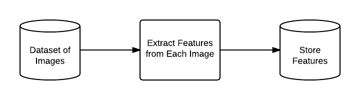
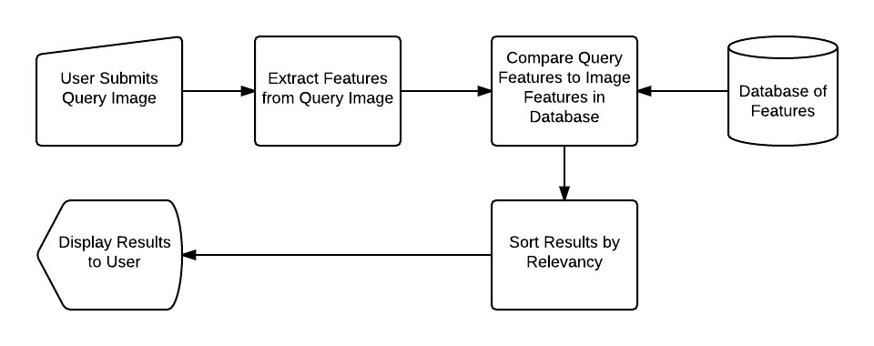

# Image_similarity
The objective of the project is that given a query image, it will find 3 most similar image from the given image directory. The images may be the duplicate images or the most simlar ones.

## Table of contents
* [General info](#general-info)
* [Project Structure](#project_str)
* [Dataset](#data)
* [Project Execution Steps](#project)
* [Flask App](#flask)
* [Conclusion](#conclusion)
* [Future Work](#future)

<a name="general-info"></a>
## General info

The objective of this project is to find out the similar images from the images directory given a query image. The dataset for this project is available in data directory. However beacuse github has its own storage constraints all the data, all the data is not reflecting in the **data** folder . 

The data can be downloaded from **[dataset](https://drive.google.com/open?id=1_Qww0NbYJOH17IiTr7bgXWQTQTFD-V9R)**. If you face downloading the dataset , do drop me a mail to gain the access credentials.

Any Content-Based Image Retrieval System we are building, they all can be boiled down into 4 distinct steps:

* **Defining your image descriptor**: At this phase we need to decide what aspect of the image we want to describe. Are we interested in the color of the image or in the shape of an object in the image or we want to characterize texture?
* **Indexing your dataset**: Now that we have our image descriptor defined, our job is to apply this image descriptor to each image in our dataset, extract features from these images, and write the features to storage (ex. CSV file) so that they can be later compared for similarity.
* **Defining our similarity metric**: We have a bunch of feature vectors. But how do we compare them? Popular choices include the Euclidean distance, Cosine distance, and chi-squared distance, but the actual choice is highly dependent on (1) our dataset and (2) the types of features we extracted.
* **Searching**: The final step is to perform an actual search. A user will submit a query image to our system (from an upload form or via a mobile app, for instance) and our job will be to 

(1) extract features from this query image and then 

(2) apply our similarity function to compare the query features to the features already indexed. From there, we simply return the most relevant results according to our similarity function.

Steps 1 and 2 involves the following:

<div style="text-align: center"></div>

We can then move on to performing a search (Steps 3 and 4):

<div style="text-align: center"></div>

<a name="project_str"></a>
## Project Structure

The entire project structure is as follows:
```
├── data
|__ images1.jpg
|__ images2.jpg
|__ .....
├── images
│   ├── preprocessing_and_indexing.jpg
│   └── searching.jpg
├── queries
│   ├── Classic_Mid-Rise_Skinny_Jeansimg_00000050.jpg
│   └── Cropped_Trench_Coatimg_00000004.jpg
├── src
│   ├── colordescriptor.py
│   └── searcher.py
├── README.md
├── Similar_images1.jpg
├── Similar_images2.jpg
├── index.py
├── index1.csv
├── name_change.py
└── search.py
```
